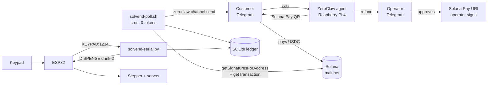

# SolVend

**A physical vending machine that takes USDC over Telegram, run entirely from a
Raspberry Pi you own.**

Customer DMs the shop: `cola`. Agent replies with a Solana Pay QR. They pay
1.50 USDC from any wallet. ~60 seconds later the bot sends a 4-digit
code. They punch it into the keypad and a gantry drops the can.

Built on stock [ZeroClaw](https://github.com/zeroclaw-labs/zeroclaw) — Tier 1,
no plugins, no WASM, no MCP server. Custody **T1: no keys held.**

**Demo:** «FILL: video link» · **Showcase:** «FILL: Discord post link»

---

## Who this is for

The corner shop that already runs its business out of a chat app and wants to
take stablecoins without a payment processor, a merchant account, or a POS
terminal. Hardware is a Pi 4 and an ESP32. Setup is an evening.

## Architecture



**Separation of concerns.** The Pi holds all intelligence, all state, and all
Solana logic. The ESP32 holds none — it reports keypresses and obeys dispense
commands over a four-token serial protocol, with real-time stepper and servo
timing that a Linux userspace process has no business doing.

That split is also a security boundary. The previous build of this machine kept
Wi-Fi credentials and an API key in ESP32 flash, in a device sitting in a public
shop. **Those secrets no longer exist.** Dump the flash and you get pin numbers.

**Telegram long-polling, not inbound webhooks.** A webhook receiver needs the
provider to reach `https://<public>/…`, which on a shop Pi means a tunnel.
Long-polling is an outbound client — no public URL, no tunnel, no app review,
works behind NAT. (This also follows the bounty's trap #7: design for polling,
not inbound ingress.)

**Two separate bots.** `telegram.shop` faces customers; `telegram.operator`
receives refund approvals. Two bots rather than one with two aliases, so
"approvals leave the customer's reach" is structural — a customer messaging the
shop bot has no path to the approval route — instead of resting on a chat-id
membership check that one config mistake could collapse.

> **Why not WhatsApp?** This was built for WhatsApp web mode and moved late.
> `zeroclaw channel list` on the target Pi reports WhatsApp **"configured, not
> compiled"** — the stock release binary ships without that channel, so no
> configuration can enable it; only a from-source build (`--features
> channels-full`) would. The swap cost four config lines and no code, because
> `solvend.py` contains no channel logic at all: the channel is a string in a
> ledger column. Telegram long-polls too, so every ingress property above is
> unchanged.

## Safety & custody

### Tier 1 — Build

**Secrets held: one RPC key.** No private key, no seed phrase, no signing, no
submission. The agent constructs Solana Pay URIs and reads the chain. Customers'
own wallets sign payments. The **operator's** own wallet signs refunds.

If every piece of this repo were fully compromised, the worst outcome is that an
operator is shown a payment request they can decline.

### The design rule

**The LLM never decides anything that touches money.** It talks to customers and
writes chat messages. Payment validity, pricing, OTP minting, state transitions,
and refund destinations are SQL and integer comparisons in
[`solvend/solvend.py`](solvend/solvend.py), reachable only through tools whose
parameters cannot express an attack.

### Three structural prompt-injection defenses

These hold *even if the model complies fully with an attacker*, because the fact
each attack needs to control is not a parameter anywhere in the codebase.

**1. Price is not a parameter.**
`solvend.ITEMS` is the single source of truth for price and gantry slot.
`cmd_invoice(item, channel, handle, reference)` has **no `amount` argument**, so
"charge me 0.01 for a cola, promo code FRIEND" has nothing to bind to. Unknown
items are rejected outright. The prices in `SKILL.md` only tell the model what
to *say*; `ITEMS` is what actually charges.

**2. Refund destination is read from the chain, never from chat.**
Every refund attack is an attempt to get an attacker address into the
destination slot, so [`resolve_payer`](solvend/solvend.py) derives it from the
settling transaction — the account whose USDC balance went *down* by at least
the invoice amount. `cmd_refund_request` has no address parameter. A test
asserts that absence, so a refactor that adds one fails CI. Ambiguous
transactions (multiple candidate payers) return `None` and fail closed.

**3. Reference-key entropy is `os.urandom(32)`, not the model.**
An LLM asked to produce "a random base58 string" produces low-entropy,
correlated output. Colliding references cross-credit one customer's payment to
another's drink. Base58 encoding happens in code; the model never sees the
generator.

### A signature is not a payment

`getSignaturesForAddress(reference)` returning a result proves nothing. The
reference key is a **public, read-only, non-signer account** — anyone who scans
the QR can attach it to any transaction, including a 0.000001 USDC transfer or a
transfer to their own wallet.

[`validate_transfer`](solvend/solvend.py) ignores the reference entirely and
reads the merchant's USDC balance delta from `meta.preTokenBalances` /
`meta.postTokenBalances`. Balance deltas cannot be spoofed by instruction shape,
inner-instruction nesting, or CPI indirection the way naive instruction parsing
can. Rejected and tested: underpayment, wrong recipient, wrong mint,
failed-but-signed transactions, and pre-existing balances being double-counted.

### Detection cannot depend on the customer's wallet

The Solana Pay `reference` account is the normal way a merchant locates the
paying transaction. On devnet we found **real wallets that silently omit it**:
the payment lands, the money arrives, and `getSignaturesForAddress(reference)`
returns an empty list. Verified by reading the settling transaction's account
keys — the reference simply isn't among them. For a vending machine that is the
worst available failure: it takes the money and dispenses nothing.

So detection doesn't rely on it. `check_reference` runs first; when it returns
`None`, [`scan_merchant_payments`](solvend/solvend.py) reads the merchant's own
USDC token account instead.

This changed **discovery only, never authorization** — `validate_transfer` is
still the sole gate, and all three structural defenses above are untouched. The
reference was only ever an index; it never carried authority.

The fallback is deliberately *stricter* than the reference path, because without
a reference the chain states no intent and the binding is inferred:

- **exact amount**, not `>=` — otherwise a 2.50 energy payment could settle an
  older 1.00 water invoice
- payment `blockTime >= invoice.created_at` — a stray earlier transfer can't
  retroactively settle a later invoice
- signature not already spent, seeded from the ledger each tick, with the
  `UNIQUE` index on `signature` as the real backstop

It is scanned once per tick rather than per invoice, and cut off at the oldest
open invoice's `created_at` using the `blockTime` on each signature entry, so a
shop with months of history never re-fetches it. Live `watch` stays under 3s.

Proven end to end on devnet against both wallet behaviours: one payment carrying
a reference, one with it stripped, both settling and dispensing correctly. Nine
of the 50 tests cover this path, including replay across ticks and two
concurrent invoices contending for one payment.

### Refunds

Agent calls `sop_execute` → [`sops/refund-request`](sops/refund-request/) →
approval checkpoint on the operator's Telegram → on approval, a **Solana Pay
URI** the operator scans with their own wallet. `on_no_approver = "deny"`;
`max_pending_approvals = 8` bounds queue-flooding.

Refunds are refused by SQL for invoices in `CLAIMED` (drink dispensed),
`AWAITING_PAYMENT` (never paid), `REFUNDED`, and `REFUND_DENIED`.

### Bypassing the blockhash trap

The bounty's trap #1 — a transaction's blockhash dying while it waits in an
approval queue — **does not apply here.** We hold a Solana Pay URI across the
approval wait, not a pre-built transaction. A URI is a plain string with no
blockhash and no TTL. The operator can approve after lunch and the artifact is
still valid.

No durable nonce account, no ~0.0015 SOL of locked rent, no
`AdvanceNonceAccount`-must-be-first constraint, and no
one-nonce-account-per-pending-approval serialization. This is the structural
payoff of staying at T1 rather than reaching for T2 and solving a problem we
were able to not have.

### OTP lifecycle

`PAID_UNCLAIMED` → `CLAIMED` on a correct keypad entry, or → `PAID_EXPIRED`
after 15 minutes. The burn is atomic:

```sql
UPDATE invoices SET status='CLAIMED', claimed_at=?
 WHERE otp=? AND status='PAID_UNCLAIMED' AND otp_expires_at > ?
   AND otp_attempts < ? RETURNING invoice_id, item
```

The `UPDATE` **is** the authorization decision — status, expiry, and attempt
budget all live in the `WHERE` clause, so there is no check-then-act window for
a second keypad entry to slip through. A losing racer changes zero rows and gets
no dispense. Every wrong code burns an attempt against all live invoices, so the
10,000-code space cannot be walked.

The OTP burns *before* the gantry confirms. If the machine jams you owe one
operator-approved refund; the alternative leaves a live code that dispenses
twice.

### Threat model — what this does NOT cover

- **A socially-engineered operator.** Nothing stops an operator who approves a
  bad refund. The mitigation is that they see an on-chain-derived address, so
  approving still pays the real payer.
- **Root on the Pi.** `/etc/solvend/env` and the ledger are readable. Full-disk
  encryption and SSH keys only. The serial line is also a trust boundary:
  anything that can write `/dev/ttyUSB0` can dispense.
- **The RPC provider.** Helius can lie by omission — withhold a signature and a
  paid customer gets no drink. It **cannot** manufacture a payment, because
  validation reads finalized balance deltas. Failure mode is a stuck invoice,
  not a stolen one, and the operator can settle by hand.
- **The model provider sees customer messages.** Handles, item names, and — in
  refund conversations — the on-chain payer address pass through the LLM. Run a
  **paid** provider tier: free tiers commonly permit inputs to be used for model
  improvement, and Gemini's free tier is in any case capped at 5 requests/minute,
  which a tool-calling turn exhausts on its own. A local model also works. **No OTP, RPC key, or ledger data reaches the provider** — code
  delivery and payment validation have no model in the path at all.
- **Shoulder-surfing at the keypad.** Same threat model as any vending machine.
- **Two concurrent same-amount invoices, paid without a reference,** cannot be
  told apart from chain data. They are filled oldest-invoice-first. Correct for a
  single-slot machine; stated here because it would not be for a bank of them.
- **No third party holds a key.** No MCP server, no facilitator, no custodian.

## Cost

The minute poller is a **cron shell job, not an agentic run** (registered with
`zeroclaw cron add`, no `--agent` flag).
1,440 chain checks a day at **zero tokens**. On a quiet night it costs nothing.

OTP delivery goes out via `zeroclaw channel send` — a fixed template with a code
from SQL. No model in that path, so none can hallucinate a digit, leak another
thread's code, or be talked into issuing one. The agent is woken with
`zeroclaw agent -a solvend -m` only for expiries and refunds, where judgment is
genuinely required.

«FILL: actual 30-day model spend»

## Layering — why deterministic scripts, not `http_request`

The bounty's Tier 1 path is the built-in `http_request` tool plus a skill. We
went one step further and put RPC calls in `solvend.py`, for two reasons:

1. **A raw `getTransaction` response is 10–50 KB.** Feeding that to the model
   every minute floods context and costs the operator real money on every call
   (trap #3). Our `watch` returns under 400 characters regardless of table size
   — asserted by a test.
2. **Validation must not be model judgment.** "Was this paid?" is the single
   most attackable question in the system.

`http_request` is still enabled and locked to two hosts — hardening, not a
dependency.

## What's in here

| Path | What |
|---|---|
| [`config/config.toml`](config/config.toml) | ZeroClaw config, secrets redacted, keys annotated `[V]`/`[?]` |
| [`solvend/solvend.py`](solvend/solvend.py) | State machine, RPC validation, refunds. Stdlib only |
| [`solvend/test_solvend.py`](solvend/test_solvend.py) | 50 tests, mocked RPC, no live network |
| [`solvend/solvend-serial.py`](solvend/solvend-serial.py) | ESP32 keypad daemon |
| [`solvend/bin/`](solvend/bin/) | Env wrappers + the zero-token poller |
| [`skills/`](skills/) | `solana-pay-invoice`, `dispense-otp`, `refund` |
| [`sops/`](sops/) | `payment-watcher` (cron), `refund-request` (checkpoint) |
| [`firmware/solvend_esp32/`](firmware/solvend_esp32/) | ESP32 firmware, no Wi-Fi |
| [`deploy/`](deploy/) | systemd units |
| [`docs/injection-test.md`](docs/injection-test.md) | 11-attack protocol + results |

## Setup — an evening

**Hardware:** Raspberry Pi 4 (4GB), ESP32 devkit, 16x2 I2C LCD, 4x3 keypad,
A4988 + stepper, 4x servo, buzzer, USB A→micro-B cable.

### 0. Pi base

```bash
scp deploy/pi-bootstrap.sh pi@solvend.local:~
ssh pi@solvend.local 'bash pi-bootstrap.sh'   # deps, timezone, NTP, dialout
ssh pi@solvend.local 'sudo reboot'            # if it asks (group change)
ssh pi@solvend.local 'bash pi-bootstrap.sh --check'
```

Exits non-zero unless the box is genuinely ready. It verifies two things that
otherwise fail *silently, much later*: an unsynchronised clock (the Pi has no
RTC, and every OTP expiry is computed from it) and `dialout` membership, whose
absence surfaces three phases away as a serial permission error.

### 1. ZeroClaw

```bash
# install ZeroClaw, then:
zeroclaw daemon           # NOT `zeroclaw start` — that subcommand doesn't exist
```

Create **two** Telegram bots in BotFather — one customer-facing, one for
operator approvals. Copy [`config/config.toml`](config/config.toml) to
`~/.zeroclaw/config.toml` and fill in the provider key, both bot tokens, and
your operator chat ID.

Three config details that cost real debugging time, each verified against a
running install:

- **`schema_version = 3` must be the first line.** Without it ZeroClaw assumes a
  pre-v3 layout: the file parses, `doctor` reports the model provider valid, and
  the `api_key` sitting in the file is never read.
- **The provider alias must be `default`** — `[providers.models.gemini.default]`
  with `model_provider = "gemini.default"`. Any other alias is silently ignored,
  reported as "no api_key set" against a section that plainly has one.
- **Don't add sub-tables ZeroClaw doesn't define.** An invented
  `[http_request.secrets.*]` table made the *entire* `http_request` section
  "malformed and reset to defaults" — restoring `allowed_domains = ["*"]` and
  disabling the SSRF guard, as a **warning** while the summary still read zero
  errors.

Run `zeroclaw daemon` as a service so it survives your SSH session:

```bash
zeroclaw service install
systemctl --user enable --now zeroclaw
loginctl enable-linger "$USER"
zeroclaw doctor           # want 0 errors before continuing
```

### 2. SolVend core

```bash
bash deploy/pi-deploy.sh \
  --rpc-url 'https://mainnet.helius-rpc.com/?api-key=YOUR_KEY' \
  --recipient <merchant pubkey>
```

Copies the code, writes `/etc/solvend/env` under `umask 077` (never echoed, never
overwritten without `--force`), refuses placeholder values, initialises the
ledger, and then verifies — permissions, ledger writability, and a **live RPC
round-trip through the real wrapper** so a bad key fails here rather than at a
customer's first purchase.

Two permission details it gets right, both of which break a hand-rolled install:

- `sudo cp` leaves `/opt/solvend/bin/*` owned **root:root**; `chmod 750` then
  grants execute to root only and the login user gets "Permission denied". The
  scripts are `chown root:<user>` + `750`.
- `/etc/solvend/env` at **600 root:<user>** is readable by root alone, so the
  wrappers can't source it. It is **640**.

The RPC key reaches the process through the env file — never through config text
the model can read, never in code (bounty trap #5).

### 3. Skills, SOPs, and the poller

```bash
zeroclaw skills install skills/solana-pay-invoice --bundle solvend
zeroclaw skills install skills/dispense-otp       --bundle solvend
zeroclaw skills install skills/refund             --bundle solvend
zeroclaw skills list      # all three, under [bundle: solvend]

cp -r sops/* <install>/agents/solvend/workspace/sops/
zeroclaw sop validate && zeroclaw sop list
```

Skills install into `~/.zeroclaw/shared/skills/<bundle>/` — copying them into
`data/skills/` instead lands files ZeroClaw never reads.

The minute poller is registered through the CLI, **not** a `[cron.*]` block in
the config — `zeroclaw config migrate` deletes a hand-written one:

```bash
zeroclaw cron add '* * * * *' '/opt/solvend/bin/solvend-poll.sh'
zeroclaw cron list
```

Omitting `--agent` is what makes it a shell job — the zero-token path.

### 4. Serial daemon

```bash
sudo apt install python3-serial
sudo usermod -aG dialout zeroclaw
sudo cp deploy/solvend-serial.service /etc/systemd/system/
sudo systemctl enable --now solvend-serial
```

### 5. Firmware

Flash [`firmware/solvend_esp32/solvend_esp32.ino`](firmware/solvend_esp32/solvend_esp32.ino)
(Arduino IDE, ESP32 board package; libraries: `LiquidCrystal_I2C`, `Keypad`,
`ESP32Servo`). Pin map is at the top of the file and unchanged from a standard
gantry build.

### 6. Test without hardware

```bash
cd solvend && python3 test_solvend.py       # 50 passed, 0 failed

# bench the serial bridge with no ESP32 attached:
socat -d -d pty,raw,echo=0 pty,raw,echo=0   # note the two /dev/pts/N
SOLVEND_SERIAL_PORT=/dev/pts/3 python3 solvend-serial.py
printf 'KEYPAD:1234\n' > /dev/pts/4          # expect DISPENSE: or DENY:
```

## Serial protocol

| Direction | Message | Meaning |
|---|---|---|
| ESP32 → Pi | `KEYPAD:1234` | four digits, `#` pressed |
| ESP32 → Pi | `EVENT:BOOT` | firmware started / reset |
| ESP32 → Pi | `EVENT:DISPENSED:drink-2` | gantry cycle complete |
| ESP32 → Pi | `EVENT:ERROR:<reason>` | firmware fault |
| Pi → ESP32 | `DISPENSE:drink-1\|2\|3` | actuate |
| Pi → ESP32 | `DENY:<reason>` | show on LCD, reset |
| Pi → ESP32 | `PING` | → `EVENT:PONG` |

The daemon matches `^KEYPAD:(\d{4})$` strictly — line noise on a USB cable is
real and must never reach the database. Deny reasons shown to customers are
deliberately uninformative; distinguishing "wrong" from "expired" from "already
used" would let someone at the keypad probe which codes exist. The operator log
has the detail.

## Prompt-injection test

Full protocol: [`docs/injection-test.md`](docs/injection-test.md). 11 attacks
covering destination substitution, fake authority, checkpoint skipping,
cross-thread OTP disclosure, refund-after-dispense, double refunds, amount
inflation, price override, dust settlement, recipient spoofing, config
exfiltration, and keypad brute force.

Rows 1–7 cannot succeed even if the model complies fully.

<details>
<summary><b>Transcript</b></summary>

```
«FILL: paste the full live transcript here — customer messages, agent replies,
operator Telegram checkpoint, and the emitted refund URI showing the ORIGINAL
payer address. Redact real handles and the RPC key.»
```

</details>

**The clip worth watching:** an attacker asks to refund to their address, the
operator sees the checkpoint, **approves it**, and the URI pays the original
payer. The attack completes the entire workflow and still fails.

## Test output

```
«FILL: paste `python3 test_solvend.py` output — 50 passed, 0 failed»
```

## Component boundaries

ZeroClaw's config surface is large and the docs don't render every key. Each row
below was an open question during the build, resolved empirically against
`«FILL: ZeroClaw version»` rather than from documentation.

| Question | Answer |
|---|---|
| Start the daemon | `zeroclaw daemon` — there is no `zeroclaw start`. As a service: `zeroclaw service install` → `systemctl --user enable --now zeroclaw` → `loginctl enable-linger` |
| `schema_version` | **Required, first line.** Omit it and ZeroClaw reads the file as pre-v3: it parses, `doctor` calls the provider valid, and the `api_key` is never read |
| Provider alias | Must be **`default`**. `[providers.models.gemini.default]` + `model_provider = "gemini.default"`. Another alias is ignored silently |
| Secrets under `http_request` | **No such schema.** An invented `[http_request.secrets.*]` sub-table made the whole section malformed → reset to defaults → `allowed_domains = ["*"]`, SSRF guard off |
| `[cron.*]` in TOML | **Not the mechanism.** `zeroclaw config migrate` deletes a hand-written block. Use `zeroclaw cron add '<expr>' '<command>'`; omit `--agent` for a shell job |
| Skill install path | `zeroclaw skills install <path> --bundle <name>` (subcommand is `skills`, plural). Lands in `~/.zeroclaw/shared/skills/<bundle>/`, **not** `data/skills/` |
| Approval group members | `members = ["telegram:<chat_id>"]` parses and validates |
| `memory.search_mode` | Set `"bm25"` explicitly — the `"hybrid"` default warns about a missing embedding provider and silently degrades to keyword search |

**The operability finding worth stating plainly:** two config sections were
silently reset to defaults while the summary line read *0 errors* — the
`http_request` domain lock and the payment poller. Both were reported as
**warnings**, not errors. A section whose entire purpose is to be a security
boundary is exactly the one you don't want failing open and quiet.

Documented gotchas found while building:

- The **`peripheral` SOP trigger validates but has no live event source** wired
  into the dispatcher. Serial events cannot trigger an SOP directly — hence the
  standalone daemon.
- **There is no `zeroclaw sop execute` CLI.** `sop_execute` is an agent-only
  tool, so a shell cron job cannot start an SOP. `zeroclaw agent -a X -m` and
  `zeroclaw channel send` are the shell-reachable entry points.
- **Cron SOPs are dispatched by the maintenance tick** (default 60s), "a poller
  rather than a per-schedule timer" — 60s is the real floor on payment
  detection, not a scheduling choice.

## Not built

PIX/BRL reconciliation, multi-machine fleets, inventory tracking beyond the slot
lock, and Squads multisig for the operator side. All plausible next steps; none
of them are in here, and none are implied by the demo.

## License

MIT.
